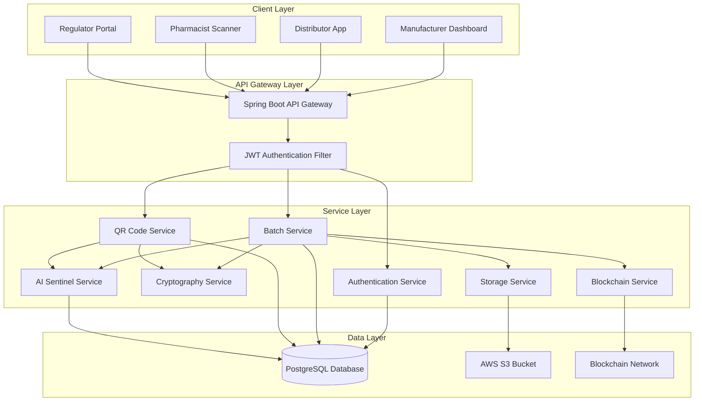
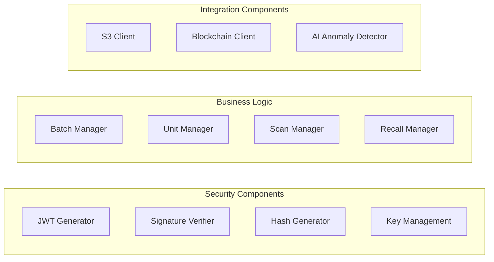
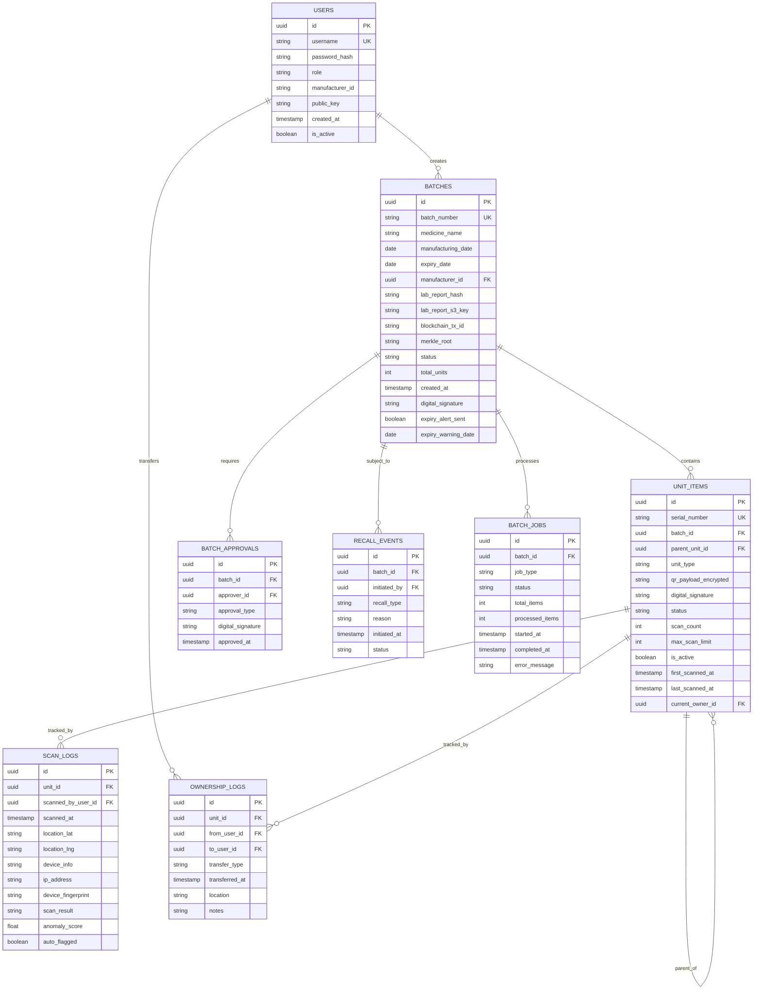
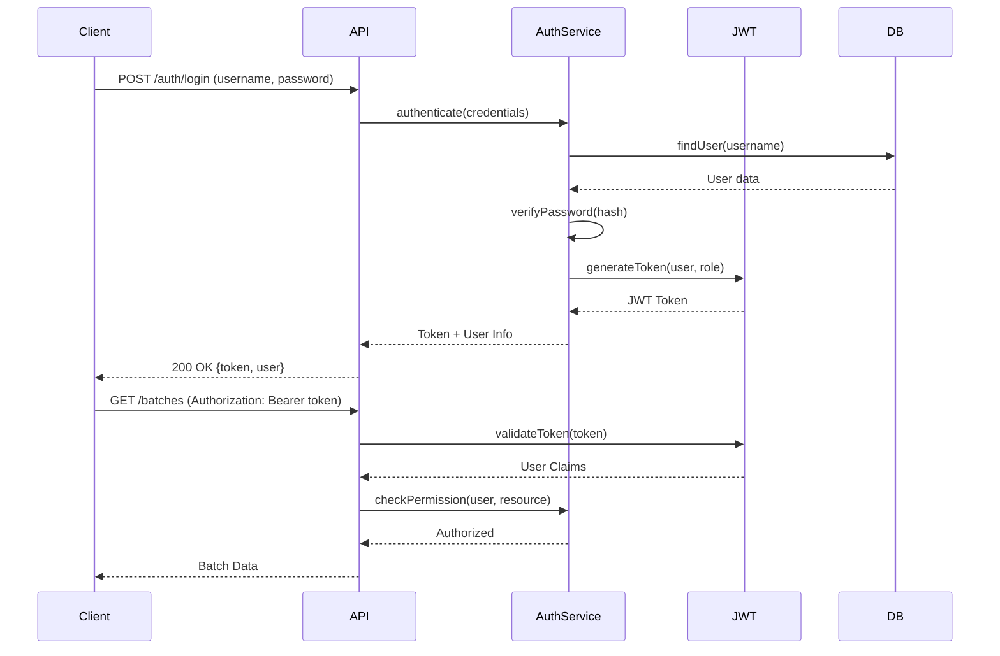
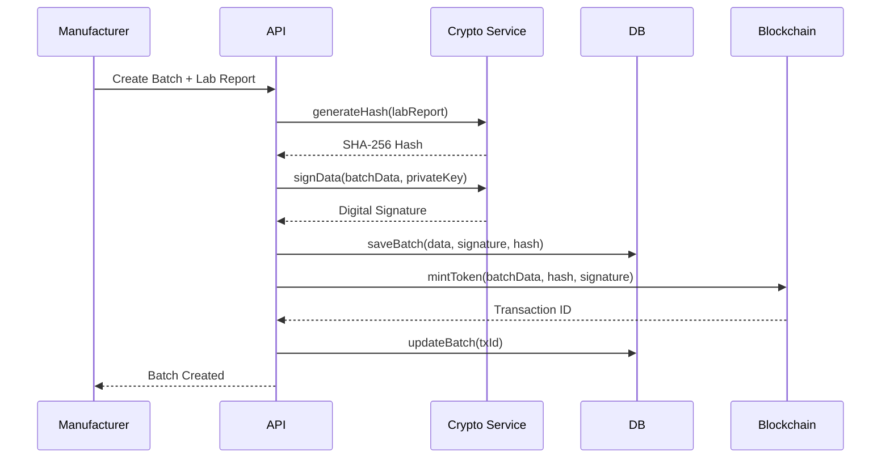
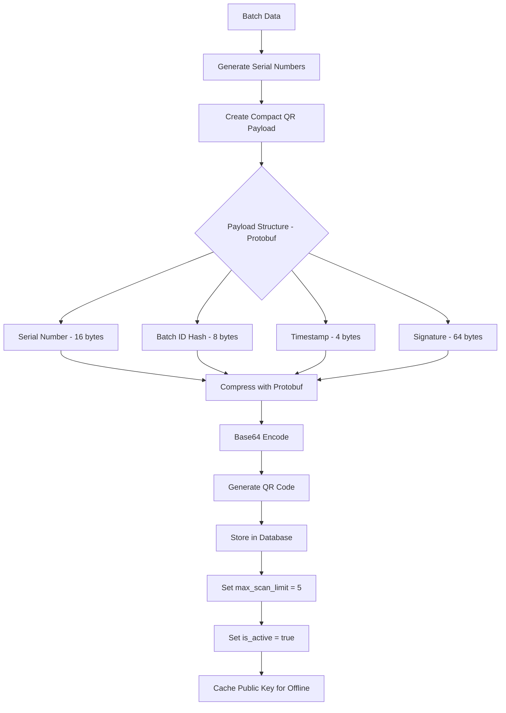

 # Technical Design Specification: PharmaTrust Production Upgrade

## 1. Overview

This document outlines the technical design for transforming PharmaTrust-AI from a prototype system to a production-ready pharmaceutical supply chain security platform. The upgrade focuses on enterprise-grade database infrastructure, cloud storage, robust authentication, and blockchain integration.

## 2. System Architecture

### 2.1 High-Level Architecture



### 2.2 Component Architecture



## 3. Data Model Design

### 3.1 PostgreSQL Schema



### 3.2 Blockchain Data Structure

```solidity
// Smart Contract Structure
// CRITICAL: Only Merkle Root is stored on blockchain to minimize gas fees
// Individual units are NOT stored on-chain
struct BatchToken {
    string batchNumber;
    string medicineHash;
    uint256 manufacturingDate;
    uint256 expiryDate;
    address manufacturer;
    bytes32 labReportHash;
    bytes32 merkleRoot;          // Single hash representing all units
    uint256 totalUnits;          // Total count for verification
    bool isActive;
    uint256 mintedAt;
}

struct RecallEvent {
    string batchNumber;
    address initiator;
    string reason;
    uint256 timestamp;
    bool autoTriggered;          // True if AI Sentinel triggered
}
```

**Gas Fee Optimization**: By storing only the Merkle Root instead of individual units, we reduce blockchain costs by 99.99% while maintaining full cryptographic verification capability.

## 4. Security Architecture

### 4.1 Authentication Flow



### 4.2 Digital Signature Flow



### 4.3 QR Code Security (Anti-Cloning with Offline Support)



**QR Payload Optimization**:
- Use Protocol Buffers (Protobuf) for compact binary encoding
- Total payload size: ~100 bytes (vs 300+ bytes with JSON)
- QR code complexity: Low (easily scannable with basic cameras)
- Format: `https://verify.pharmatrust.ai/v/{base64_protobuf_data}`

**Offline Verification Support**:
- Mobile app caches manufacturer public keys locally
- QR contains embedded digital signature
- App verifies signature offline using cached public key
- Online sync happens when internet available
- Offline mode shows: "Signature Valid (Offline)" with sync pending indicator

**Anti-Replay Attack Protection**:
- Each QR has `max_scan_limit` (default: 5 scans)
- After limit exceeded, unit is auto-flagged
- `scan_count` increments on each verification
- Geographic anomaly triggers immediate `is_active = false`
- Signature prevents QR payload tampering

## 5. Core Services Design

### 5.1 Authentication Service

**Responsibilities:**
- User registration and login
- JWT token generation and validation
- Role-based access control (RBAC)
- Public/Private key management for manufacturers

**Key Methods:**
```java
public interface AuthenticationService {
    AuthResponse login(LoginRequest request);
    void logout(String token);
    UserDetails validateToken(String token);
    void registerManufacturer(ManufacturerRegistration registration);
    KeyPair generateKeyPair(String manufacturerId);
}
```

### 5.2 Batch Service

**Responsibilities:**
- Batch creation and management
- Multi-signature approval workflow
- Batch status management (Active, Quarantine, Recalled)
- Merkle root calculation for unit verification

**Key Methods:**
```java
public interface BatchService {
    Batch createBatch(BatchRequest request, MultipartFile labReport);
    void approveBatch(UUID batchId, ApprovalRequest approval);
    void quarantineBatch(UUID batchId, String reason);
    void recallBatch(UUID batchId, RecallRequest request);
    BatchDetails getBatchDetails(UUID batchId);
    List<Batch> getManufacturerBatches(UUID manufacturerId);
}
```

### 5.3 QR Code Service

**Responsibilities:**
- Generate compact QR payloads using Protobuf
- Bulk QR generation for units
- QR verification (online and offline modes)
- Scan logging and fraud detection

**Key Methods:**
```java
public interface QRCodeService {
    String generateQRPayload(UnitItem unit, PrivateKey key);
    byte[] generateQRImage(String payload);
    CompletableFuture<Void> generateBulkQRCodes(UUID batchId, int quantity);
    VerificationResult verifyQROnline(String payload, ScanContext context);
    VerificationResult verifyQROffline(String payload, PublicKey cachedKey);
    void logScan(UUID unitId, ScanDetails details);
    byte[] serializeToProtobuf(QRPayloadData data);
    QRPayloadData deserializeFromProtobuf(byte[] data);
}
```

### 5.4 Cryptography Service

**Responsibilities:**
- RSA/ECDSA signature generation and verification
- SHA-256 hashing for file integrity
- HMAC for time-based verification
- Key storage and retrieval

**Key Methods:**
```java
public interface CryptographyService {
    String generateSHA256Hash(byte[] data);
    String signData(String data, PrivateKey privateKey);
    boolean verifySignature(String data, String signature, PublicKey publicKey);
    KeyPair generateRSAKeyPair();
    String generateHMAC(String data, String secret);
    boolean verifyHMAC(String data, String hmac, String secret);
}
```

### 5.5 Storage Service

**Responsibilities:**
- Upload lab reports to AWS S3
- Generate pre-signed URLs for secure access
- File integrity verification
- S3 bucket lifecycle management

**Key Methods:**
```java
public interface StorageService {
    String uploadLabReport(MultipartFile file, UUID batchId);
    String generatePresignedUrl(String s3Key, int expirationMinutes);
    boolean verifyFileIntegrity(String s3Key, String expectedHash);
    void deleteFile(String s3Key);
}
```

### 5.6 Blockchain Service

**Responsibilities:**
- Mint batch tokens on blockchain
- Query blockchain for batch verification
- Emit recall events
- Monitor transaction status

**Key Methods:**
```java
public interface BlockchainService {
    String mintBatchToken(BatchMetadata metadata);
    BatchToken getBatchToken(String batchNumber);
    String emitRecallEvent(String batchNumber, String reason);
    TransactionStatus getTransactionStatus(String txId);
}
```

### 5.7 AI Sentinel Service

**Responsibilities:**
- Anomaly detection in scan patterns
- Geographic fraud detection (Impossible Travel)
- IP address and device fingerprinting
- Automatic kill-switch triggering
- Predictive risk scoring
- Alert generation

**Key Methods:**
```java
public interface AISentinelService {
    AnomalyScore analyzeScanPattern(UUID unitId, ScanDetails scan);
    boolean detectGeographicAnomaly(List<ScanLog> recentScans);
    boolean detectImpossibleTravel(ScanLog current, ScanLog previous);
    void autoTriggerKillSwitch(UUID unitId, String reason);
    float calculateRiskScore(BatchData batch);
    void generateAlert(AlertType type, String message, UUID entityId);
    String generateDeviceFingerprint(HttpServletRequest request);
}
```

### 5.8 Message Queue Service

**Responsibilities:**
- Asynchronous batch job processing
- Background unit generation
- Job status tracking
- Retry mechanism for failed jobs

**Key Methods:**
```java
public interface MessageQueueService {
    String enqueueJob(JobType type, UUID entityId, Map<String, Object> params);
    JobStatus getJobStatus(String jobId);
    void processJob(String jobId);
    void retryFailedJob(String jobId);
}
```

## 6. API Design

### 6.1 Authentication Endpoints

```
POST   /api/v1/auth/register          - Register new user
POST   /api/v1/auth/login             - Login and get JWT
POST   /api/v1/auth/logout            - Invalidate token
POST   /api/v1/auth/refresh           - Refresh JWT token
GET    /api/v1/auth/me                - Get current user info
```

### 6.2 Batch Management Endpoints

```
POST   /api/v1/batches                - Create new batch
GET    /api/v1/batches                - List batches (filtered)
GET    /api/v1/batches/{id}           - Get batch details
POST   /api/v1/batches/{id}/approve   - Approve batch (multi-sig)
POST   /api/v1/batches/{id}/quarantine - Quarantine batch
POST   /api/v1/batches/{id}/recall    - Recall batch
GET    /api/v1/batches/{id}/units     - Get batch units
```

### 6.3 QR Verification Endpoints

```
POST   /api/v1/verify/scan            - Verify QR code
GET    /api/v1/verify/unit/{serial}   - Get unit details
GET    /api/v1/verify/history/{serial} - Get scan history
```

### 6.4 Regulator Endpoints (Granular RBAC)

```
GET    /api/v1/regulator/alerts       - View fraud alerts only
GET    /api/v1/regulator/recalls      - View recall events only
POST   /api/v1/regulator/kill-switch  - Emergency recall
GET    /api/v1/regulator/flagged-batches - View flagged batches only
GET    /api/v1/regulator/audit-logs   - View audit trail (no business metrics)
```

**Privacy Protection**:
- Regulators CANNOT see: production volumes, supply chain routes, business metrics
- Regulators CAN see: anomalies, recalls, fraud alerts, flagged items
- Business data only accessible during active investigation with warrant
- All regulator access logged for manufacturer transparency

### 6.5 Ownership Transfer Endpoints

```
POST   /api/v1/transfer/initiate      - Initiate unit transfer
POST   /api/v1/transfer/accept        - Accept transfer
GET    /api/v1/transfer/history/{serial} - Get ownership timeline
GET    /api/v1/transfer/pending       - Get pending transfers
```

### 6.6 Job Status Endpoints

```
GET    /api/v1/jobs/{jobId}           - Get job status
GET    /api/v1/jobs/batch/{batchId}   - Get batch jobs
POST   /api/v1/jobs/{jobId}/cancel    - Cancel running job
```

## 7. Algorithms and Processing Logic

### 7.0 QR Payload Compression (Protobuf Implementation)

```java
/**
 * Compact QR payload using Protocol Buffers
 * Reduces payload from 300+ bytes (JSON) to ~100 bytes (Protobuf)
 */

// Define Protobuf schema (qr_payload.proto)
syntax = "proto3";

message QRPayload {
    bytes serial_number = 1;      // 16 bytes (UUID)
    bytes batch_id_hash = 2;      // 8 bytes (first 8 bytes of batch UUID)
    uint32 timestamp = 3;         // 4 bytes (Unix timestamp)
    bytes signature = 4;          // 64 bytes (ECDSA signature)
}

/**
 * Generate compact QR payload
 */
public String generateCompactQRPayload(UnitItem unit, PrivateKey key) {
    // Create protobuf message
    QRPayload.Builder builder = QRPayload.newBuilder();
    
    // Serial number as bytes (16 bytes)
    builder.setSerialNumber(ByteString.copyFrom(
        uuidToBytes(UUID.fromString(unit.getSerialNumber()))
    ));
    
    // Batch ID hash (first 8 bytes only)
    builder.setBatchIdHash(ByteString.copyFrom(
        Arrays.copyOf(uuidToBytes(unit.getBatchId()), 8)
    ));
    
    // Timestamp (4 bytes)
    builder.setTimestamp((int) (System.currentTimeMillis() / 1000));
    
    // Create data to sign
    byte[] dataToSign = builder.build().toByteArray();
    
    // Sign with ECDSA (produces 64-byte signature)
    byte[] signature = signWithECDSA(dataToSign, key);
    builder.setSignature(ByteString.copyFrom(signature));
    
    // Serialize to bytes
    byte[] protobufBytes = builder.build().toByteArray();
    
    // Base64 encode for URL safety
    String base64 = Base64.getUrlEncoder().encodeToString(protobufBytes);
    
    // Create short URL format
    return "https://verify.pharmatrust.ai/v/" + base64;
}

/**
 * Verify QR payload (Offline mode)
 */
public VerificationResult verifyQROffline(String qrUrl, PublicKey cachedPublicKey) {
    try {
        // Extract base64 payload from URL
        String base64 = qrUrl.substring(qrUrl.lastIndexOf("/") + 1);
        
        // Decode from base64
        byte[] protobufBytes = Base64.getUrlDecoder().decode(base64);
        
        // Parse protobuf
        QRPayload payload = QRPayload.parseFrom(protobufBytes);
        
        // Extract signature
        byte[] signature = payload.getSignature().toByteArray();
        
        // Recreate data without signature for verification
        QRPayload.Builder verifyBuilder = QRPayload.newBuilder()
            .setSerialNumber(payload.getSerialNumber())
            .setBatchIdHash(payload.getBatchIdHash())
            .setTimestamp(payload.getTimestamp());
        byte[] dataToVerify = verifyBuilder.build().toByteArray();
        
        // Verify signature using cached public key
        boolean signatureValid = verifyECDSASignature(
            dataToVerify, 
            signature, 
            cachedPublicKey
        );
        
        if (signatureValid) {
            return VerificationResult.builder()
                .status("VALID_OFFLINE")
                .message("Signature verified offline. Sync when online.")
                .serialNumber(bytesToUuid(payload.getSerialNumber().toByteArray()))
                .needsOnlineSync(true)
                .build();
        } else {
            return VerificationResult.builder()
                .status("INVALID")
                .message("Invalid signature - possible counterfeit")
                .build();
        }
        
    } catch (Exception e) {
        return VerificationResult.builder()
            .status("ERROR")
            .message("QR code format invalid")
            .build();
    }
}
```

**Payload Size Comparison**:
- JSON format: ~320 bytes → QR complexity: High
- Protobuf format: ~92 bytes → QR complexity: Low
- Reduction: 71% smaller, easier to scan

## 7. Algorithms and Processing Logic

### 7.1 Bulk Unit Generation Algorithm (Idempotent & Crash-Safe)

```java
/**
 * Enqueue bulk unit generation job to prevent server hang
 * Uses RabbitMQ/Redis Queue for background processing
 * IDEMPOTENT: Safe to retry without creating duplicates
 */
public String createBatchWithUnits(BatchRequest request, int quantity) {
    // Step 1: Create batch record immediately
    Batch batch = new Batch();
    batch.setBatchNumber(request.getBatchNumber());
    batch.setStatus("PROCESSING");
    batch.setTotalUnits(quantity);
    batchRepository.save(batch);
    
    // Step 2: Create job record
    BatchJob job = new BatchJob();
    job.setBatchId(batch.getId());
    job.setJobType("UNIT_GENERATION");
    job.setStatus("QUEUED");
    job.setTotalItems(quantity);
    job.setProcessedItems(0);
    jobRepository.save(job);
    
    // Step 3: Enqueue to message queue (non-blocking)
    String jobId = messageQueueService.enqueueJob(
        JobType.UNIT_GENERATION, 
        batch.getId(), 
        Map.of("quantity", quantity)
    );
    
    // Return immediately - user sees "Processing..."
    return jobId;
}

/**
 * Background worker processes the job
 * IDEMPOTENT: Can be safely retried after crash
 * Uses deterministic serial numbers and ON CONFLICT DO NOTHING
 */
@RabbitListener(queues = "unit-generation-queue")
public void processUnitGeneration(String jobId) {
    BatchJob job = jobRepository.findById(jobId).orElseThrow();
    UUID batchId = job.getBatchId();
    int quantity = job.getTotalItems();
    
    try {
        int batchSize = 1000;
        List<UnitItem> buffer = new ArrayList<>(batchSize);
        
        for (int i = 0; i < quantity; i++) {
            UnitItem unit = new UnitItem();
            
            // DETERMINISTIC serial number: batch_id + index
            // Same input always produces same serial number
            unit.setSerialNumber(generateDeterministicSerial(batchId, i));
            unit.setBatchId(batchId);
            unit.setMaxScanLimit(5);
            unit.setIsActive(true);
            unit.setScanCount(0);
            unit.setDigitalSignature(signUnit(unit));
            
            buffer.add(unit);
            
            if (buffer.size() >= batchSize || i == quantity - 1) {
                // IDEMPOTENT INSERT: ON CONFLICT DO NOTHING
                // If job restarts, existing records are skipped
                unitRepository.saveAllIdempotent(buffer);
                buffer.clear();
                
                // Update progress
                job.setProcessedItems(i + 1);
                jobRepository.save(job);
            }
        }
        
        // Calculate and store Merkle root
        String merkleRoot = calculateMerkleRoot(batchId);
        batchRepository.updateMerkleRoot(batchId, merkleRoot);
        
        // Update batch status
        Batch batch = batchRepository.findById(batchId).orElseThrow();
        batch.setStatus("PENDING_APPROVAL");
        batchRepository.save(batch);
        
        // Mark job complete
        job.setStatus("COMPLETED");
        job.setCompletedAt(Instant.now());
        jobRepository.save(job);
        
    } catch (Exception e) {
        job.setStatus("FAILED");
        job.setErrorMessage(e.getMessage());
        jobRepository.save(job);
        
        // Job can be safely retried - idempotency ensures no duplicates
    }
}

/**
 * Deterministic serial number generation
 * Same batch_id + index always produces same serial
 */
private String generateDeterministicSerial(UUID batchId, int index) {
    String input = batchId.toString() + "-" + index;
    String hash = SHA256(input).substring(0, 16);
    return String.format("%s-%06d-%s", 
        batchId.toString().substring(0, 8), 
        index, 
        hash
    );
}

/**
 * Idempotent repository method using PostgreSQL ON CONFLICT
 */
@Repository
public interface UnitItemRepository extends JpaRepository<UnitItem, UUID> {
    
    @Modifying
    @Query(value = "INSERT INTO unit_items (id, serial_number, batch_id, ...) " +
                   "VALUES (:#{#item.id}, :#{#item.serialNumber}, ...) " +
                   "ON CONFLICT (serial_number) DO NOTHING", 
           nativeQuery = true)
    void saveIdempotent(@Param("item") UnitItem item);
    
    default void saveAllIdempotent(List<UnitItem> items) {
        items.forEach(this::saveIdempotent);
    }
}
```

**Key Improvements**:
- **Idempotency**: Job can be retried without creating duplicates
- **Crash-safe**: Server crash at 50% won't corrupt database
- **Deterministic**: Same input always produces same serial numbers
- **PostgreSQL ON CONFLICT**: Skips existing records automatically
- **Progress tracking**: Frontend can poll job status
- **No server hang**: Processing happens in background worker
- **Scalable**: Multiple workers can process jobs in parallel

### 7.2 Merkle Tree Verification

```java
/**
 * Calculate Merkle root for batch integrity
 */
public String calculateMerkleRoot(UUID batchId) {
    List<String> serialNumbers = unitRepository
        .findSerialNumbersByBatchId(batchId);
    
    List<String> hashes = serialNumbers.stream()
        .map(this::hash)
        .collect(Collectors.toList());
    
    while (hashes.size() > 1) {
        List<String> newLevel = new ArrayList<>();
        for (int i = 0; i < hashes.size(); i += 2) {
            String left = hashes.get(i);
            String right = (i + 1 < hashes.size()) ? hashes.get(i + 1) : left;
            newLevel.add(hash(left + right));
        }
        hashes = newLevel;
    }
    
    return hashes.get(0);
}
```

### 7.3 Geographic Anomaly Detection with Auto Kill-Switch

```java
/**
 * Detect impossible geographic movements (Impossible Travel)
 * Automatically triggers kill-switch if anomaly detected
 */
public boolean detectGeographicAnomaly(UUID unitId, ScanLog currentScan) {
    List<ScanLog> recentScans = scanLogRepository
        .findTop5ByUnitIdOrderByScannedAtDesc(unitId);
    
    if (recentScans.isEmpty()) return false;
    
    ScanLog previousScan = recentScans.get(0);
    
    // Check 1: Geographic Impossible Travel
    double distance = calculateDistance(
        previousScan.getLocationLat(), previousScan.getLocationLng(),
        currentScan.getLocationLat(), currentScan.getLocationLng()
    );
    
    long timeDiffMinutes = Duration.between(
        previousScan.getScannedAt(), 
        currentScan.getScannedAt()
    ).toMinutes();
    
    double maxPossibleSpeed = 200.0; // km/h (considering flight)
    double actualSpeed = (distance / timeDiffMinutes) * 60;
    
    boolean impossibleTravel = actualSpeed > maxPossibleSpeed;
    
    // Check 2: IP Address & Device Fingerprint Mismatch
    boolean ipMismatch = !currentScan.getIpAddress()
        .equals(previousScan.getIpAddress());
    
    boolean deviceMismatch = !currentScan.getDeviceFingerprint()
        .equals(previousScan.getDeviceFingerprint());
    
    // Check 3: Simultaneous scans from different locations
    boolean simultaneousScans = timeDiffMinutes < 5 && distance > 50;
    
    // If any critical anomaly detected, auto-trigger kill-switch
    if (impossibleTravel || simultaneousScans) {
        currentScan.setAutoFlagged(true);
        currentScan.setAnomalyScore(1.0f);
        scanLogRepository.save(currentScan);
        
        // Auto kill-switch
        UnitItem unit = unitRepository.findById(unitId).orElseThrow();
        unit.setIsActive(false);
        unit.setStatus("RECALLED_AUTO");
        unitRepository.save(unit);
        
        // Generate alert
        aiSentinelService.generateAlert(
            AlertType.GEOGRAPHIC_FRAUD,
            String.format("Impossible travel detected: %.2f km in %d minutes", 
                distance, timeDiffMinutes),
            unitId
        );
        
        return true;
    }
    
    // Medium risk: Flag but don't auto-recall
    if (ipMismatch && deviceMismatch && distance > 100) {
        currentScan.setAnomalyScore(0.7f);
        scanLogRepository.save(currentScan);
        
        aiSentinelService.generateAlert(
            AlertType.SUSPICIOUS_SCAN,
            "Multiple device/location changes detected",
            unitId
        );
    }
    
    return false;
}
```

**Auto Kill-Switch Logic**:
- Impossible travel (>200 km/h) → Immediate auto-recall
- Simultaneous scans (<5 min, >50 km apart) → Immediate auto-recall
- IP + Device + Location change → Warning alert (manual review)
- All events logged for regulator audit

### 7.4 Multi-Signature Approval Logic

```java
/**
 * Require multiple approvals before batch activation
 */
public void checkAndActivateBatch(UUID batchId) {
    Batch batch = batchRepository.findById(batchId)
        .orElseThrow(() -> new NotFoundException("Batch not found"));
    
    List<BatchApproval> approvals = approvalRepository
        .findByBatchId(batchId);
    
    // Require at least 2 approvals from different roles
    Set<String> approverRoles = approvals.stream()
        .map(a -> a.getApprover().getRole())
        .collect(Collectors.toSet());
    
    boolean hasProductionHead = approverRoles.contains("PRODUCTION_HEAD");
    boolean hasQualityChecker = approverRoles.contains("QUALITY_CHECKER");
    
    if (hasProductionHead && hasQualityChecker && approvals.size() >= 2) {
        batch.setStatus("ACTIVE");
        batchRepository.save(batch);
        
        // Mint on blockchain
        blockchainService.mintBatchToken(batch);
    }
}
```

### 7.5 Parent-Child Cascade Recall

```java
/**
 * Recursively recall all child units when parent is recalled
 */
public void cascadeRecall(UUID parentUnitId) {
    UnitItem parent = unitRepository.findById(parentUnitId)
        .orElseThrow(() -> new NotFoundException("Unit not found"));
    
    parent.setStatus("RECALLED");
    unitRepository.save(parent);
    
    // Find all children recursively
    List<UnitItem> children = unitRepository
        .findByParentUnitId(parentUnitId);
    
    for (UnitItem child : children) {
        cascadeRecall(child.getId()); // Recursive call
    }
}
```

## 8. Configuration and Deployment

### 8.1 Application Properties

```properties
# Database Configuration
spring.datasource.url=jdbc:postgresql://localhost:5432/pharmatrust
spring.datasource.username=${DB_USERNAME}
spring.datasource.password=${DB_PASSWORD}
spring.jpa.hibernate.ddl-auto=validate
spring.jpa.properties.hibernate.dialect=org.hibernate.dialect.PostgreSQLDialect

# JWT Configuration
jwt.secret=${JWT_SECRET}
jwt.expiration=86400000
jwt.refresh-expiration=604800000

# AWS S3 Configuration
aws.s3.bucket-name=${S3_BUCKET_NAME}
aws.s3.region=${AWS_REGION}
aws.access-key-id=${AWS_ACCESS_KEY}
aws.secret-access-key=${AWS_SECRET_KEY}

# Blockchain Configuration
blockchain.network-url=${BLOCKCHAIN_RPC_URL}
blockchain.contract-address=${CONTRACT_ADDRESS}
blockchain.private-key=${BLOCKCHAIN_PRIVATE_KEY}
blockchain.gas-optimization=true
blockchain.merkle-only=true

# Message Queue Configuration (RabbitMQ)
spring.rabbitmq.host=${RABBITMQ_HOST:localhost}
spring.rabbitmq.port=${RABBITMQ_PORT:5672}
spring.rabbitmq.username=${RABBITMQ_USER:guest}
spring.rabbitmq.password=${RABBITMQ_PASSWORD:guest}

# Queue Names
queue.unit-generation=unit-generation-queue
queue.qr-generation=qr-generation-queue
queue.blockchain-mint=blockchain-mint-queue

# Async Configuration
spring.task.execution.pool.core-size=10
spring.task.execution.pool.max-size=50
spring.task.execution.pool.queue-capacity=1000

# QR Security Configuration
qr.max-scan-limit=5
qr.scan-warning-threshold=3

# AI Sentinel Configuration
ai.max-travel-speed-kmh=200
ai.simultaneous-scan-threshold-minutes=5
ai.auto-killswitch-enabled=true
```

### 8.2 Docker Compose Setup

```yaml
version: '3.8'

services:
  postgres:
    image: postgres:15-alpine
    environment:
      POSTGRES_DB: pharmatrust
      POSTGRES_USER: pharma_user
      POSTGRES_PASSWORD: ${DB_PASSWORD}
    ports:
      - "5432:5432"
    volumes:
      - postgres_data:/var/lib/postgresql/data
    healthcheck:
      test: ["CMD-SHELL", "pg_isready -U pharma_user"]
      interval: 10s
      timeout: 5s
      retries: 5

  rabbitmq:
    image: rabbitmq:3-management-alpine
    ports:
      - "5672:5672"
      - "15672:15672"
    environment:
      RABBITMQ_DEFAULT_USER: ${RABBITMQ_USER:guest}
      RABBITMQ_DEFAULT_PASS: ${RABBITMQ_PASSWORD:guest}
    volumes:
      - rabbitmq_data:/var/lib/rabbitmq
    healthcheck:
      test: ["CMD", "rabbitmq-diagnostics", "ping"]
      interval: 10s
      timeout: 5s
      retries: 5

  redis:
    image: redis:7-alpine
    ports:
      - "6379:6379"
    volumes:
      - redis_data:/data
    healthcheck:
      test: ["CMD", "redis-cli", "ping"]
      interval: 10s
      timeout: 5s
      retries: 5

  app:
    build: .
    ports:
      - "8080:8080"
    environment:
      DB_USERNAME: pharma_user
      DB_PASSWORD: ${DB_PASSWORD}
      JWT_SECRET: ${JWT_SECRET}
      AWS_ACCESS_KEY: ${AWS_ACCESS_KEY}
      AWS_SECRET_KEY: ${AWS_SECRET_KEY}
      S3_BUCKET_NAME: pharmatrust-lab-reports
      RABBITMQ_HOST: rabbitmq
      RABBITMQ_USER: ${RABBITMQ_USER:guest}
      RABBITMQ_PASSWORD: ${RABBITMQ_PASSWORD:guest}
    depends_on:
      postgres:
        condition: service_healthy
      rabbitmq:
        condition: service_healthy
      redis:
        condition: service_healthy

volumes:
  postgres_data:
  rabbitmq_data:
  redis_data:
```

## 9. Security Considerations

### 9.1 Key Management
- Private keys stored in AWS Secrets Manager or HashiCorp Vault
- Key rotation policy: every 90 days
- Separate keys for different environments (dev, staging, prod)

### 9.2 Data Encryption
- TLS 1.3 for all API communications
- AES-256 encryption for sensitive data at rest
- S3 bucket encryption enabled (SSE-S3 or SSE-KMS)

### 9.3 Access Control (Granular RBAC)

**Manufacturer Access**:
- Create/view own batches
- Upload lab reports
- Quarantine own batches
- View own production metrics

**Distributor Access**:
- Transfer ownership
- Scan units
- View supply chain for owned units
- Cannot see other distributors' data

**Pharmacist Access**:
- Verify units
- View batch details (limited)
- Report suspicious units
- Cannot see supply chain routes

**Regulator Access (Privacy-Protected)**:
- View fraud alerts ONLY
- View recall events ONLY
- View flagged batches ONLY
- Trigger emergency recalls
- CANNOT see: production volumes, supply routes, business metrics
- Full access requires investigation warrant (logged and notified to manufacturer)

**API Security**:
- Rate limiting: 100 requests/minute per user
- IP whitelisting for regulator endpoints
- All regulator actions logged and visible to manufacturers
- Principle of least privilege enforced

### 9.4 Audit Logging
- All batch operations logged
- All approval actions logged
- All recall events logged
- Logs stored in separate audit database

## 10. Performance Optimization

### 10.1 Database Indexing
```sql
CREATE INDEX idx_batch_number ON batches(batch_number);
CREATE INDEX idx_serial_number ON unit_items(serial_number);
CREATE INDEX idx_batch_id ON unit_items(batch_id);
CREATE INDEX idx_parent_unit_id ON unit_items(parent_unit_id);
CREATE INDEX idx_scan_unit_id ON scan_logs(unit_id);
CREATE INDEX idx_scan_timestamp ON scan_logs(scanned_at);
```

### 10.2 Caching Strategy
- Redis cache for frequently accessed batch data
- Cache TTL: 5 minutes for batch details
- Cache invalidation on batch status change

### 10.3 Async Processing
- Bulk unit generation: Asynchronous with CompletableFuture
- QR code generation: Background job queue
- Blockchain transactions: Non-blocking with callback

## 11. Monitoring and Observability

### 11.1 Metrics
- API response times
- Database query performance
- Blockchain transaction success rate
- S3 upload/download latency
- AI anomaly detection accuracy

### 11.2 Alerts
- Failed blockchain transactions
- High anomaly scores (> 0.8)
- Geographic fraud detection
- System resource utilization > 80%

### 11.3 Logging
- Structured logging (JSON format)
- Log levels: ERROR, WARN, INFO, DEBUG
- Centralized logging with ELK stack or CloudWatch

## 12. Testing Strategy

### 12.1 Unit Tests
- Service layer: 80%+ coverage
- Cryptography functions: 100% coverage
- Algorithm correctness: Property-based testing

### 12.2 Integration Tests
- API endpoints: Full CRUD operations
- Database transactions: Rollback scenarios
- S3 integration: Upload/download/delete
- Blockchain integration: Mock contract

### 12.3 Performance Tests
- Load testing: 1000 concurrent users
- Bulk operations: 100,000 units in < 5 minutes
- API response time: < 200ms (p95)

## 13. Migration Strategy

### 13.1 Data Migration
1. Export existing SQLite data
2. Transform schema to PostgreSQL format
3. Migrate batch and unit data
4. Verify data integrity
5. Update application configuration

### 13.2 Zero-Downtime Deployment
1. Deploy new version alongside old
2. Route 10% traffic to new version
3. Monitor for errors
4. Gradually increase traffic
5. Decommission old version

## 14. Future Enhancements

### 14.1 Zero-Knowledge Proofs (ZKP)
- Prove batch purity without revealing formula
- Integration with zk-SNARKs libraries
- Privacy-preserving verification

### 14.2 IoT Integration
- Temperature sensors during transit
- Automated scan logging
- Real-time supply chain visibility

### 14.3 Mobile SDK (Offline-First)
- Native Android/iOS QR scanner
- Offline verification using cached public keys
- Local database for pending scans
- Auto-sync when internet available
- Push notifications for recalls
- Low-bandwidth mode for rural areas
- Support for 2G/3G networks

### 14.4 Advanced QR Features
- Dynamic QR codes with time-based rotation
- Multi-level QR (batch → box → strip → tablet)
- NFC tag integration for premium products
- Holographic QR with physical tamper-evidence

---

**Document Version**: 1.0  
**Last Updated**: 2026-03-12  
**Status**: Draft
